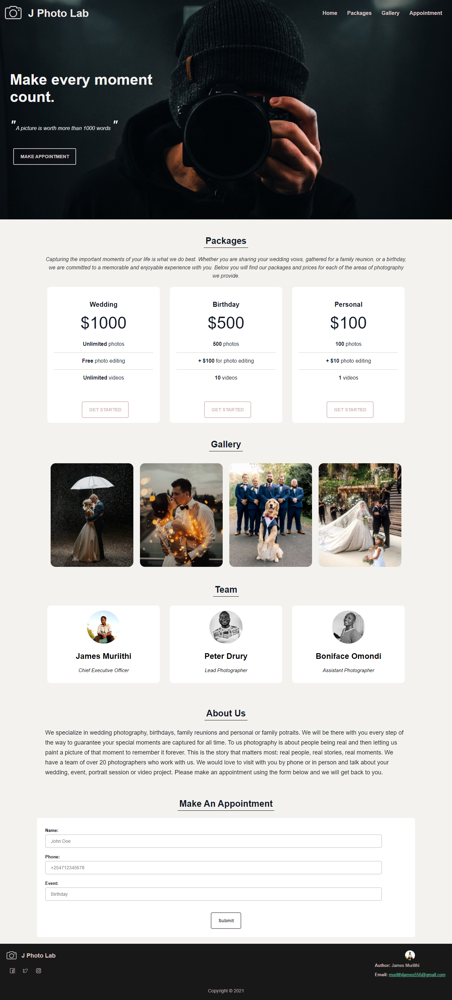

# J Photo Lab
### This is a portfolio website for our photography company J Photo Lab

## Project Description
### Week one Moringa School independent project (IP).

## Website Demo
### [Here](https://james-muriithi.github.io/j-photolab/) is a link to the website demo

## Project Setup
### Download the code and open the index.html file with a browser of your choice.

## Technologies used
1. HTML
1. CSS

## Design
## A simple design of the website

## Screenshot

## Contact Details
* Phone: +254746792699
* Email: muriithijames556@gmail.com

## Licence
* MIT licence Copyright © 2021 James Muriithi.